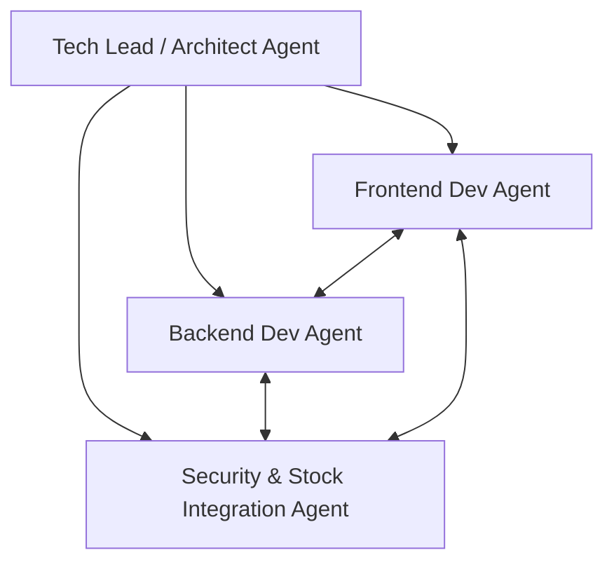

# AI 개발 팀 정의 및 협업 가이드라인 (AI Developer Team & Collaboration Guidelines)

본 문서는 Spring Boot 3, Java 21, JPA, PostgreSQL, JWT 인증, React, Tailwind CSS v3 기반의 **토스 스타일 주식 정보 & 커뮤니티 플랫폼** 프로젝트를 성공적으로 이끌기 위해 구성된 AI 에이전트 팀의 역할과 협업 프로세스를 정의합니다.

---

## 1. AI 개발 팀 구성 (Agent Team Roles)

플랫폼의 풀스택 구현과 안정적인 API 연동을 위해 다음과 같이 4개의 전문 에이전트 역할을 정의합니다.



### 1) 테크 리드 / 아키텍트 에이전트 (Tech Lead & Architect Agent)
- **주요 역할**: 프로젝트 구조 설계, 데이터베이스 모델링(ERD), API 명세 설계, 에이전트 간 역할 중재 및 코드 통합 리뷰.
- **주요 책임**:
  - `backend/`와 `frontend/` 간의 인터페이스 규격(JSON 포맷, HTTP 상태 코드 등) 일치 여부 검증.
  - 패키지 및 컴포넌트 구조의 표준 준수 검토.

### 2) 백엔드 개발 에이전트 (Backend Developer Agent)
- **주요 역할**: Spring Boot 3, Java 21, JPA, Lombok, PostgreSQL 기반 비즈니스 로직 및 REST API 구현.
- **주요 책임**:
  - JPA Entity 설계 (Lombok 어노테이션 활용: `@Getter`, `@RequiredArgsConstructor`, `@Builder` 등 생성자/Getter 위주 설계로 무분별한 Setter 사용 지양).
  - 자유게시판(Free Board), 공지사항(Notice) CRUD 기능 및 페이징/정렬 기능 구현.
  - 회원 정보 관리(비밀번호 암호화 저장 등) 비즈니스 레이어 개발.

### 3) 프론트엔드 개발 에이전트 (Frontend Developer Agent)
- **주요 역할**: React, Tailwind CSS v3, React Router v6 기반 토스 스타일의 프리미엄 UI/UX 및 클라이언트 로직 구현.
- **주요 책임**:
  - 토스 디자인 가이드라인(Rounded-3xl 카드 UI, HSL 기반의 그레이/블루 테마, 미세한 애니메이션) 구현.
  - React Router를 이용한 페이지 분할 및 라우팅 설정.
  - Recharts 등을 활용한 주식 가격 차트 렌더링.
  - 백엔드 API 연동을 위한 Axios 클라이언트 모듈 구축 및 Auth Context(JWT) 상태 관리.

### 4) 보안 및 주식 연동 에이전트 (Security & Stock Integration Agent)
- **주요 역할**: Spring Security 및 JWT 인증 시스템 구축, 한국투자증권 API(MCP 서버 연동) 게이트웨이 및 데이터 동기화 구현.
- **주요 책임**:
  - Spring Security 필터 체인 설계 및 JWT 토큰(AccessToken/RefreshToken) 발급 및 검증 로직 구현.
  - MCP 서버를 이용한 한국투자증권 API 연동 인터페이스 설계 및 주식 실시간/주가 이력 데이터 수집 모듈 개발.
  - 보안 토큰 및 외부 API Key 유출 방지를 위한 환경 설정 및 암호화 관리.

---

## 2. 에이전트 협업 프로세스 (Workflow Guidelines)

성공적인 빌드를 위해 모든 에이전트는 다음 규칙에 따라 상호 작용합니다.

1. **API 우선 디자인 (API-First Development)**:
   - 프론트엔드와 백엔드 개발을 동시에 진행하기 전, 아키텍트 에이전트가 API 명세서(경로, 요청/응답 형식)를 최종 확정합니다.
2. **독립적 기능 구현 및 모킹 (Mocking)**:
   - 프론트엔드는 백엔드 API가 완성되기 전이라도 모의 데이터(Mock Data)를 활용해 UI/UX 화면을 완성할 수 있도록 컴포넌트를 설계합니다.
   - 백엔드는 외부 API 연동 지연에 대비해 `StockService`에 Mock 모드를 활성화할 수 있는 설정을 포함시킵니다.
3. **Lombok 사용 표준**:
   - JPA Entity 사용 시 `@EqualsAndHashCode`, `@ToString` 등을 무분별하게 사용할 경우 무한 루프가 발생할 수 있으므로 필요한 경우에만 제한적으로 오버라이드합니다.
   - `@Data` 보다는 `@Getter`, `@Setter` 및 빌더 패턴(`@Builder`)을 활용합니다.

---

## 3. 코드 작성 가이드라인 (Coding Standards)

### 백엔드 (Java & Spring Boot)
- **Java 버전**: 21 (Record, Pattern Matching, Switch Expression 적극 활용)
- **Spring Boot**: 3.x
- **패키지 명명**: `com.kosmo.stockapp` 하위에 역할별 패키지 구성.
- **예외 처리**: 글로벌 예외 처리기(`@RestControllerAdvice`)를 정의하여 모든 API의 에러 응답 형식을 통일.
- **Response Format**: 
  ```json
  {
    "success": true,
    "message": "요청이 성공적으로 처리되었습니다.",
    "data": { ... }
  }
  ```

### 프론트엔드 (React & Tailwind CSS)
- **Tailwind CSS v3**: 커스텀 설정은 `tailwind.config.js`에 설정하여 토스 블루(`theme.colors.tossBlue`) 및 토스 그레이 계열 색상을 일관되게 사용.
- **컴포넌트 분리**: 재사용 가능한 컴포넌트(Button, Card, Input)는 `components/` 폴더에 위치시키고, 상태를 가지는 큰 화면 단위는 `pages/`에 배치.
- **경로 매핑**: 절대 경로 설정을 위해 Vite 설정을 도입(예: `@/components/...`).

---

## 4. 마크다운 문서 위치 안내 (Markdown Document Locations)

에이전트들이 개발을 조율하고 이력을 기록하기 위해 참조 및 업데이트해야 하는 핵심 마크다운 파일들의 위치는 다음과 같습니다. 모든 에이전트는 작업 수행 시 아래의 문서를 수시로 확인하고 최신 상태를 유지해야 합니다.

* **에이전트 가이드라인 및 규칙 정의서** (현재 파일)
  - 경로: `c:/yubin/workspace/kosmo_react_vibe/.agent/AGENT.md`
  - 용도: 개발 에이전트들의 역할 정의, 협업 규칙, 코드 작성 표준 보관.
* **프로젝트 구현 계획서 (Implementation Plan)**
  - 경로: `C:/Users/KOSMO/.gemini/antigravity/brain/f9def686-b524-469b-9870-d895487cdc1a/implementation_plan.md`
  - 용도: 데이터베이스 스키마 및 REST API 명세서, 전반적인 구조 변경 계획 수록.
* **작업 관리 체크리스트 (Task checklist)**
  - 경로: `C:/Users/KOSMO/.gemini/antigravity/brain/f9def686-b524-469b-9870-d895487cdc1a/task.md`
  - 용도: 세부 태스크 구현 현황 추적 (`[ ]` 미진행, `[/]` 진행중, `[x]` 완료 표시).
* **기능 완료 검증 문서 (Walkthrough)**
  - 경로: `C:/Users/KOSMO/.gemini/antigravity/brain/f9def686-b524-469b-9870-d895487cdc1a/walkthrough.md`
  - 용도: 기능 구현 후 테스트 결과 요약, 화면 스크린샷 및 동작 검증 내용 기록.

---

## 5. 문서 관리 및 업데이트 (Documentation Guide)

1. **Task 관리 (`task.md`)**:
   - 에이전트가 작업을 수행할 때마다 `task.md`를 업데이트하여 완료된 작업(`[x]`)과 진행 중인 작업(`[/]`)을 투명하게 기록합니다.
2. **API 명세 업데이트**:
   - 백엔드 컨트롤러에 변경이 있을 경우 즉시 프론트엔드 에이전트에게 API 규격 변경 내용을 전파합니다.
3. **코드 주석 및 설명**:
   - 도메인 지식이 요구되는 비즈니스 로직이나 한국투자증권 API의 명세 등은 상세히 주석으로 작성하여 후속 개발이 용이하도록 합니다.
